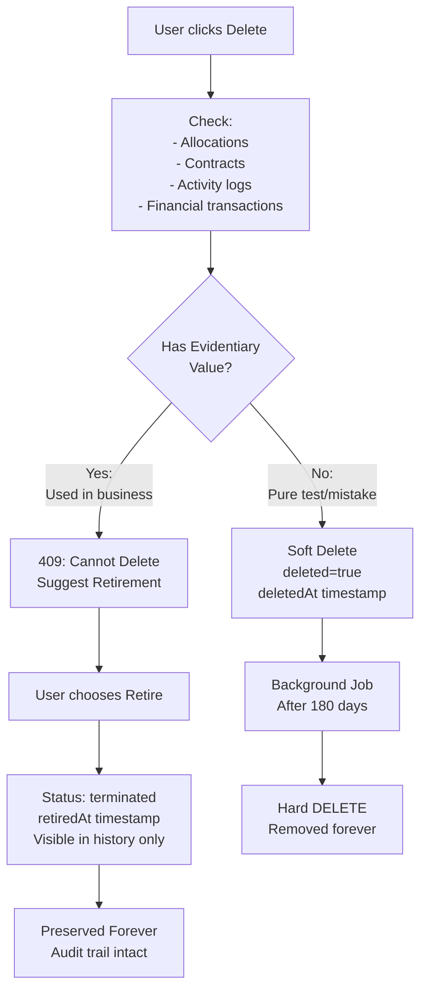

# Three-Tier Data Lifecycle Implementation

## Context

Implementing the data lifecycle philosophy: **Active** (currently true) → **Retired** (was once true, preserve forever) → **Deleted** (never became true, safe to purge after 180 days).

This is foundational architecture that must be correct from day one, before production data exists.

## Migration Strategy: Drop and Recreate

**IMPORTANT**: This plan modifies existing migration files (`001_structure` files) rather than creating new migrations. This is correct because:

1. **Pre-launch state**: All current data is test/pre-launch data
2. **Implementation approach**: Drop all schemas → Re-run migrations with updated structure
3. **No production data**: There's no risk of data loss

**Commands to execute**:

```bash
# Drop existing schemas
psql "$PRIMARY_DATABASE_URL" -c "DROP SCHEMA IF EXISTS config CASCADE;"
psql "$PRIMARY_DATABASE_URL" -c "DROP SCHEMA IF EXISTS company CASCADE;"
psql "$PRIMARY_DATABASE_URL" -c "DROP SCHEMA IF EXISTS customer CASCADE;"

# Re-run migrations with lifecycle columns
bash database/run-migrations-dev.sh

# Regenerate Prisma clients
cd apps/backoffice/api && pnpm db:generate
```

**For production deployment (future)**: This pattern is already established. New production servers will run these migrations from scratch with lifecycle columns included from day one.

## Architecture Overview



## Phase 1: Schema Foundation (All Entities)

Update foundational migration files to add lifecycle columns to ALL business entities.

### Files to Update

#### 1. **[database/schemas/config/001_structure_2024-12-14.sql](database/schemas/config/001_structure_2024-12-14.sql)**

**Users table** - Add deleted columns (for test accounts only, around line 40):

```sql
-- Lifecycle management (deleted for test accounts, disabled for real users)
deleted BOOLEAN DEFAULT false,
deleted_at TIMESTAMPTZ,
deleted_by TEXT REFERENCES config.users(id),
deleted_reason TEXT,
```

Add index:

```sql
CREATE INDEX idx_users_deleted ON config.users(deleted) WHERE deleted = false;
```

**Roles table** - Add retired columns (all roles preserved forever):

```sql
-- Lifecycle management (roles only retire, never delete)
retired BOOLEAN DEFAULT false,
retired_at TIMESTAMPTZ,
retired_by TEXT REFERENCES config.users(id),
retired_reason TEXT,
```

Add index:

```sql
CREATE INDEX idx_roles_retired ON config.roles(retired) WHERE retired = false;
```

Add constraint to prevent retiring system roles:

```sql
ALTER TABLE config.roles ADD CONSTRAINT check_system_not_retired
  CHECK (is_system = false OR retired = false);
```

#### 2. **[database/schemas/company/001_structure_2024-12-15.sql](database/schemas/company/001_structure_2024-12-15.sql)**

Add to `warehouses` table (after `notes` column, around line 48):

```sql
-- Lifecycle management
deleted BOOLEAN DEFAULT false,
deleted_at TIMESTAMPTZ,
deleted_by TEXT REFERENCES config.users(id),
deleted_reason TEXT,
retired_at TIMESTAMPTZ,
retired_by TEXT REFERENCES config.users(id),
retired_reason TEXT,
```

Update status check constraint to include 'retired':

```sql
status TEXT NOT NULL DEFAULT 'active' CHECK (status IN ('active', 'commissioning', 'offline', 'decommissioned', 'retired')),
```

Add indices:

```sql
CREATE INDEX idx_warehouses_deleted ON company.warehouses(deleted) WHERE deleted = false;
CREATE INDEX idx_warehouses_lifecycle ON company.warehouses(status, deleted, retired_at);
```

#### 3. **[database/schemas/customer/001_structure_2024-12-14.sql](database/schemas/customer/001_structure_2024-12-14.sql)**

Add to `customers` table (after `updated_at`, around line 30):

```sql
-- Lifecycle management
deleted BOOLEAN DEFAULT false,
deleted_at TIMESTAMPTZ,
deleted_by TEXT REFERENCES config.users(id),
deleted_reason TEXT,
retired_at TIMESTAMPTZ,
retired_by TEXT REFERENCES config.users(id),
retired_reason TEXT,
is_test_data BOOLEAN DEFAULT false,  -- Explicit test data flag
```

Update status check to include 'terminated':

```sql
status TEXT NOT NULL DEFAULT 'prospect' CHECK (status IN ('prospect', 'active', 'onboarding', 'suspended', 'terminated')),
```

Add to `warehouse_allocations`, `facilities`, `contacts`, `contracts` (each with appropriate columns):

```sql
-- For warehouse_allocations, facilities, contacts:
deleted BOOLEAN DEFAULT false,
deleted_at TIMESTAMPTZ,
deleted_by TEXT REFERENCES config.users(id),
deleted_reason TEXT,

-- For contracts (never deletable, only archived):
archived_at TIMESTAMPTZ,
archived_by TEXT REFERENCES config.users(id),
archived_reason TEXT,
```

Add indices:

```sql
CREATE INDEX idx_customers_deleted ON customer.customers(deleted) WHERE deleted = false;
CREATE INDEX idx_customers_lifecycle ON customer.customers(status, deleted, retired_at);
CREATE INDEX idx_customers_test_data ON customer.customers(is_test_data) WHERE is_test_data = true;
CREATE INDEX idx_contacts_deleted ON customer.contacts(deleted) WHERE deleted = false;
CREATE INDEX idx_facilities_deleted ON customer.facilities(deleted) WHERE deleted = false;
CREATE INDEX idx_warehouse_allocations_deleted ON customer.warehouse_allocations(deleted) WHERE deleted = false;
```

## Phase 1.5: User & Role Lifecycle Strategy

### Users: Disabled vs Deleted

**Semantic distinction** (critical for audit trails):

- **`disabled: true`** = Tier 2 (Retired) - User cannot log in, but preserved for audit trail (who created/modified records)
- **`deleted: true`** = Tier 3 (Purge) - Test account with no activity, never logged in, safe to purge

**Decision tree**:

```typescript
// Has activity (integrationRuns, contactLogs, managed resources, or ever logged in)?
// → Must DISABLE, cannot delete (permanent audit trail)

// Created but never logged in, no activity?
// → Can SOFT-DELETE (test account, will purge after 180 days)

// System users (e.g., 'system')?
// → Cannot delete or disable (like isSystem roles)
```

**Why both fields?**:

- `disabled` is the user-facing control (HR removes employee → disable account)
- `deleted` is the data management control (test account cleanup)
- They are mutually exclusive: `disabled=true` means "was real, preserve forever"

### Roles: Evidentiary by Default

**Decision**: All roles are evidentiary - **only retire, never delete**.

**Rationale**:

- Roles define permissions that affected system behavior
- Even if currently unused, roles have historical significance (who had what access when?)
- Simpler than tracking historical UserRole assignments
- Cost is negligible (roles are small, rarely created)

**Pattern**:

- Add `retired: Boolean` column to roles (no `deleted` column)
- Retired roles hidden from assignment UI but preserved forever
- System roles (`isSystem: true`) cannot be retired

**Add to roles table**:

```sql
ALTER TABLE config.roles ADD COLUMN retired BOOLEAN DEFAULT false;
ALTER TABLE config.roles ADD COLUMN retired_at TIMESTAMPTZ;
ALTER TABLE config.roles ADD COLUMN retired_by TEXT REFERENCES config.users(id);
ALTER TABLE config.roles ADD COLUMN retired_reason TEXT;
```

### Contracts: Never Deletable, Only Archivable

**Decision**: Contracts are **legal documents** - no `deleted` column at all.

**Pattern**:

- Contracts use `archived_at` instead of `deleted_at`
- Archived = hidden from default views, preserved forever
- Can only archive contracts with `status IN ('expired', 'terminated')`
- Active contracts cannot be archived

**Schema already has** `archived_at`, `archived_by`, `archived_reason` columns (from Phase 1).

### WarehouseZone Lifecycle (Operational Config)

**Decision**: Zones use **hard delete** (no lifecycle columns).

**Rationale**:

- Zones are operational configuration, not transactional entities
- No financial or legal implications
- When warehouse is deleted/retired, zones inherit state (queries filter by parent)
- Individual zone deletion is rare and acceptable

**Future consideration**: If zones gain transactional history (e.g., zone-specific inventory tracking), revisit lifecycle pattern.

## Phase 2: Prisma Schema Updates

Update Prisma schemas to reflect new lifecycle columns.

### Files to Update

#### **[apps/backoffice/api/prisma/schema-primary.prisma](apps/backoffice/api/prisma/schema-primary.prisma)**

Update all business entity models:

```prisma
model Warehouse {
  // ... existing fields ...
  
  // Lifecycle management
  deleted       Boolean   @default(false)
  deletedAt     DateTime? @map("deleted_at")
  deletedBy     String?   @map("deleted_by")
  deletedReason String?   @map("deleted_reason")
  retiredAt     DateTime? @map("retired_at")
  retiredBy     String?   @map("retired_by")
  retiredReason String?   @map("retired_reason")
  
  deletedByUser User? @relation("WarehouseDeletedBy", fields: [deletedBy], references: [id])
  retiredByUser User? @relation("WarehouseRetiredBy", fields: [retiredBy], references: [id])
}

model Customer {
  // ... existing fields ...
  
  // Lifecycle management
  deleted       Boolean   @default(false)
  deletedAt     DateTime? @map("deleted_at")
  deletedBy     String?   @map("deleted_by")
  deletedReason String?   @map("deleted_reason")
  retiredAt     DateTime? @map("retired_at")
  retiredBy     String?   @map("retired_by")
  retiredReason String?   @map("retired_reason")
  isTestData    Boolean   @default(false) @map("is_test_data")
  
  deletedByUser User? @relation("CustomerDeletedBy", fields: [deletedBy], references: [id])
  retiredByUser User? @relation("CustomerRetiredBy", fields: [retiredBy], references: [id])
}

// Similar updates for Contact, CustomerFacility, WarehouseAllocation
```

Update User model to include lifecycle relations:

```prisma
model User {
  // ... existing fields ...
  
  // Lifecycle audit trail relations
  deletedCustomers  Customer[]  @relation("CustomerDeletedBy")
  retiredCustomers  Customer[]  @relation("CustomerRetiredBy")
  deletedWarehouses Warehouse[] @relation("WarehouseDeletedBy")
  retiredWarehouses Warehouse[] @relation("WarehouseRetiredBy")
}
```

## Phase 2.5: Cascade Behavior Strategy

**Decision**: Orphan approach - child records are NOT automatically marked as deleted when parent is deleted.

**Rationale**:

- When querying, we always filter by parent: `WHERE customer.deleted = false`
- This join automatically excludes children of deleted customers
- Simpler than cascading delete flags through the tree
- Prevents complex cascade logic and potential bugs
- Children can still be individually marked as deleted if needed

**Example**:

```typescript
// When customer is soft-deleted:
await prisma.customer.update({
  where: { id },
  data: { deleted: true, deletedAt: new Date(), deletedBy: userId }
});

// Contacts, facilities, etc. are NOT marked deleted
// But queries like this automatically exclude them:
const customers = await prisma.customer.findMany({
  where: { deleted: false },  // Only non-deleted customers
  include: {
    contacts: true,  // Automatically filtered by parent
    facilities: true
  }
});
```

**Database constraint validation**: Add check constraint to prevent invalid state transitions (Phase 2.5.1).

## Phase 2.5.1: Status Transition Validation

Add validation to prevent conflicting lifecycle states.

**Add to customer table in [database/schemas/customer/001_structure_2024-12-14.sql](database/schemas/customer/001_structure_2024-12-14.sql)**:

```sql
-- Constraint: Cannot be both deleted and terminated
-- If deleted=true, status must be 'prospect', 'active', 'onboarding', or 'suspended'
-- If status='terminated', deleted must be false
ALTER TABLE customer.customers ADD CONSTRAINT check_deleted_or_terminated
  CHECK (
    (deleted = false) OR 
    (deleted = true AND status IN ('prospect', 'active', 'onboarding', 'suspended'))
  );
```

**Add to warehouse table in [database/schemas/company/001_structure_2024-12-15.sql](database/schemas/company/001_structure_2024-12-15.sql)**:

```sql
ALTER TABLE company.warehouses ADD CONSTRAINT check_deleted_or_retired
  CHECK (
    (deleted = false) OR 
    (deleted = true AND status IN ('active', 'commissioning', 'offline', 'decommissioned'))
  );
```

**Rationale**: Retired/terminated entities are preserved forever (audit trail). Deleted entities are marked for purge. These are mutually exclusive states.

## Phase 3: Usage Detection Service

Create a service to determine if an entity has evidentiary value.

### New File: **[apps/backoffice/api/src/services/usage-detection.ts](apps/backoffice/api/src/services/usage-detection.ts)**

```typescript
import { prismaPrimary } from '../db/index.js';

export interface EvidentaryCheck {
  hasValue: boolean;
  reason: string;
  details?: Record<string, number>;
}

/**
 * Determines if an entity has evidentiary value (participated in real business)
 * According to three-tier lifecycle philosophy
 */
export async function checkEvidentaryValue(
  entity: 'customer' | 'warehouse' | 'contact' | 'facility' | 'user' | 'contract',
  entityId: string
): Promise<EvidentaryCheck> {
  
  switch (entity) {
    case 'customer':
      return checkCustomerValue(entityId);
    case 'warehouse':
      return checkWarehouseValue(entityId);
    case 'contact':
      return checkContactValue(entityId);
    case 'facility':
      return checkFacilityValue(entityId);
    case 'user':
      return checkUserValue(entityId);
    case 'contract':
      return checkContractValue(entityId);
  }
}

async function checkCustomerValue(customerId: string): Promise<EvidentaryCheck> {
  const customer = await prismaPrimary.customer.findUnique({
    where: { id: customerId },
    select: {
      isTestData: true,
      _count: {
        select: {
          warehouseAllocations: true,
          contracts: true,
          contactLog: true,
          facilities: true,
        }
      }
    }
  });

  if (!customer) {
    return { hasValue: false, reason: 'Customer not found' };
  }

  // Explicit test data flag
  if (customer.isTestData) {
    return { hasValue: false, reason: 'Marked as test data', details: customer._count };
  }

  // Any warehouse allocation = operational truth
  if (customer._count.warehouseAllocations > 0) {
    return { 
      hasValue: true, 
      reason: 'Has warehouse allocations (operational footprint)',
      details: customer._count
    };
  }

  // Any contract = legal/financial truth (even drafts have negotiation history)
  if (customer._count.contracts > 0) {
    return { 
      hasValue: true, 
      reason: 'Has contracts (legal evidence)',
      details: customer._count
    };
  }

  // Communication history = sales/relationship truth
  if (customer._count.contactLog > 0) {
    return { 
      hasValue: true, 
      reason: 'Has communication history (relationship evidence)',
      details: customer._count
    };
  }

  // Has facilities = planning truth (even if never shipped)
  if (customer._count.facilities > 0) {
    return { 
      hasValue: true, 
      reason: 'Has facilities configured (planning evidence)',
      details: customer._count
    };
  }

  return { 
    hasValue: false, 
    reason: 'No transactional footprint - safe to delete',
    details: customer._count
  };
}

async function checkWarehouseValue(warehouseId: string): Promise<EvidentaryCheck> {
  const warehouse = await prismaPrimary.warehouse.findUnique({
    where: { id: warehouseId },
    select: {
      _count: {
        select: {
          warehouseAllocations: true,  // ANY allocation, not just active
          zones: true,
        }
      }
    }
  });

  if (!warehouse) {
    return { hasValue: false, reason: 'Warehouse not found' };
  }

  // ANY allocation (active, inactive, terminated) = operational truth
  if (warehouse._count.warehouseAllocations > 0) {
    return { 
      hasValue: true, 
      reason: 'Has allocation history (operational evidence - must retire)',
      details: warehouse._count
    };
  }

  // Zones configured = planning truth (even if never allocated)
  if (warehouse._count.zones > 0) {
    return { 
      hasValue: true, 
      reason: 'Has zones configured (planning evidence)',
      details: warehouse._count
    };
  }

  return { 
    hasValue: false, 
    reason: 'No operational footprint - safe to delete',
    details: warehouse._count
  };
}

async function checkContactValue(contactId: string): Promise<EvidentaryCheck> {
  const contact = await prismaPrimary.contact.findUnique({
    where: { id: contactId },
    select: {
      customer: { select: { isTestData: true, deleted: true } },
      _count: {
        select: {
          contactLog: true,
        }
      }
    }
  });

  if (!contact) {
    return { hasValue: false, reason: 'Contact not found' };
  }

  // Belongs to deleted/test customer = safe to delete
  if (contact.customer.deleted || contact.customer.isTestData) {
    return { hasValue: false, reason: 'Belongs to test/deleted customer' };
  }

  // Has communication history = relationship evidence
  if (contact._count.contactLog > 0) {
    return { 
      hasValue: true, 
      reason: 'Has communication history',
      details: contact._count
    };
  }

  return { hasValue: false, reason: 'No communication history' };
}

async function checkFacilityValue(facilityId: string): Promise<EvidentaryCheck> {
  const facility = await prismaPrimary.customerFacility.findUnique({
    where: { id: facilityId },
    select: {
      customer: { select: { isTestData: true, deleted: true } },
    }
  });

  if (!facility) {
    return { hasValue: false, reason: 'Facility not found' };
  }

  // Belongs to test/deleted customer = safe to delete
  if (facility.customer.deleted || facility.customer.isTestData) {
    return { hasValue: false, reason: 'Belongs to test/deleted customer' };
  }

  // If parent customer is active/retired, facility has value
  return { 
    hasValue: true, 
    reason: 'Belongs to active/retired customer (preserve as history)'
  };
}

async function checkUserValue(userId: string): Promise<EvidentaryCheck> {
  const user = await prismaPrimary.user.findUnique({
    where: { id: userId },
    select: {
      disabled: true,
      _count: {
        select: {
          integrationRuns: true,
          managedWarehouses: true,
          contactLogs: true,
          sessions: true,  // Ever logged in?
          deletedCustomers: true,
          retiredCustomers: true,
          deletedWarehouses: true,
          retiredWarehouses: true,
        }
      }
    }
  });

  if (!user) {
    return { hasValue: false, reason: 'User not found' };
  }

  // Already disabled = was real user, cannot delete (only disable)
  if (user.disabled) {
    return { 
      hasValue: true, 
      reason: 'User is disabled (preserved for audit trail)',
      details: user._count
    };
  }

  // Check for ANY activity
  const totalActivity = Object.values(user._count).reduce((a, b) => a + b, 0);
  
  if (totalActivity > 0) {
    return { 
      hasValue: true, 
      reason: 'User has activity - must disable, not delete',
      details: user._count
    };
  }

  return { 
    hasValue: false, 
    reason: 'User never logged in, no activity - safe to delete',
    details: user._count
  };
}

async function checkContractValue(contractId: string): Promise<EvidentaryCheck> {
  const contract = await prismaPrimary.contract.findUnique({
    where: { id: contractId },
    select: {
      status: true,
      archivedAt: true,
    }
  });

  if (!contract) {
    return { hasValue: false, reason: 'Contract not found' };
  }

  // Contracts are NEVER deletable - they're legal documents
  // Can only be archived if expired/terminated
  if (contract.status === 'active') {
    return { 
      hasValue: true, 
      reason: 'Active contract - cannot delete or archive (legal document)'
    };
  }

  if (contract.archivedAt) {
    return { 
      hasValue: true, 
      reason: 'Contract already archived (preserved forever)'
    };
  }

  // Expired/terminated but not archived - can be archived
  return { 
    hasValue: true, 
    reason: 'Contract can be archived (not deleted - legal requirement)',
    suggestion: 'archive'  // Special case: don't delete, archive instead
  };
}
```

## Phase 4: Update DELETE Endpoints

Update all delete endpoints to respect the three-tier lifecycle.

### Files to Update

#### 1. **[apps/backoffice/api/src/routes/warehouses.ts](apps/backoffice/api/src/routes/warehouses.ts)**

Replace current DELETE endpoint (lines 131-149):

```typescript
import { checkEvidentaryValue } from '../services/usage-detection.js';

// DELETE /api/warehouses/:id - Smart delete with lifecycle awareness
fastify.delete('/:id',
  { preHandler: requirePermission(PERMISSIONS.MANAGE_WAREHOUSES) },
  async (request, reply) => {
    const { id } = request.params as { id: string };
    const { reason } = request.body as { reason?: string };

    // Check if warehouse has evidentiary value
    const valueCheck = await checkEvidentaryValue('warehouse', id);

    if (valueCheck.hasValue) {
      return reply.status(409).send({
        error: 'Cannot delete warehouse with history',
        reason: valueCheck.reason,
        details: valueCheck.details,
        suggestion: {
          action: 'retire',
          message: 'This warehouse has been used in operations. Please retire it instead.',
          endpoint: `PATCH /api/warehouses/${id}`,
          payload: { 
            status: 'retired',
            retiredReason: reason || 'Warehouse no longer in use'
          }
        }
      });
    }

    // Safe to soft-delete
    await prismaPrimary.warehouse.update({
      where: { id },
      data: {
        deleted: true,
        deletedAt: new Date(),
        deletedBy: request.user.id,
        deletedReason: reason || 'Never used - safe to purge'
      }
    });

    return reply.status(204).send();
  }
);
```

#### 2. **[apps/backoffice/api/src/routes/clients.ts](apps/backoffice/api/src/routes/clients.ts)**

Add smart DELETE endpoint:

```typescript
import { checkEvidentaryValue } from '../services/usage-detection.js';

// DELETE /api/clients/:id - Smart delete with lifecycle awareness
fastify.delete('/:id',
  { preHandler: requirePermission(PERMISSIONS.MANAGE_CLIENTS) },
  async (request, reply) => {
    const { id } = request.params as { id: string };
    const { reason } = request.body as { reason?: string };

    const valueCheck = await checkEvidentaryValue('customer', id);

    if (valueCheck.hasValue) {
      return reply.status(409).send({
        error: 'Cannot delete customer with history',
        reason: valueCheck.reason,
        details: valueCheck.details,
        suggestion: {
          action: 'terminate',
          message: 'This customer has business history. Please terminate the relationship instead.',
          endpoint: `PATCH /api/clients/${id}`,
          payload: { 
            status: 'terminated',
            retiredReason: reason || 'Customer relationship ended'
          }
        }
      });
    }

    // Safe to soft-delete
    await prismaPrimary.customer.update({
      where: { id },
      data: {
        deleted: true,
        deletedAt: new Date(),
        deletedBy: request.user.id,
        deletedReason: reason || 'Test/abandoned customer - safe to purge'
      }
    });

    return reply.status(204).send();
  }
);
```

#### 3. **[apps/backoffice/api/src/routes/clients.ts](apps/backoffice/api/src/routes/clients.ts)**

Update contact DELETE endpoint (currently around line 451-461) to use smart delete logic:

```typescript
import { checkEvidentaryValue } from '../services/usage-detection.js';

// DELETE /api/clients/:customerId/contacts/:id - Smart delete for contacts
fastify.delete('/:customerId/contacts/:id',
  { preHandler: requirePermission(PERMISSIONS.MANAGE_CLIENTS) },
  async (request, reply) => {
    const { id } = request.params as { customerId: string; id: string };
    const { reason } = request.body as { reason?: string };

    // Check if contact has evidentiary value
    const valueCheck = await checkEvidentaryValue('contact', id);

    if (valueCheck.hasValue) {
      // Contact has communication history - mark as inactive instead of delete
      await prismaPrimary.contact.update({
        where: { id },
        data: {
          active: false,  // Retire contact, don't delete
        }
      });
      
      return reply.send({ 
        message: 'Contact marked as inactive (has communication history)',
        action: 'deactivated'
      });
    }

    // No history - safe to soft-delete
    await prismaPrimary.contact.update({
      where: { id },
      data: {
        deleted: true,
        deletedAt: new Date(),
        deletedBy: request.user.id,
        deletedReason: reason || 'No communication history - safe to purge'
      }
    });

    return reply.status(204).send();
  }
);
```

## Phase 4.5: User, Role, and Contract Endpoints

Add lifecycle endpoints for config schema entities.

### New File: **[apps/backoffice/api/src/routes/users.ts](apps/backoffice/api/src/routes/users.ts)**

```typescript
import { checkEvidentaryValue } from '../services/usage-detection.js';

// DELETE /api/users/:id - Smart delete for users
fastify.delete('/:id',
  { preHandler: requirePermission(PERMISSIONS.MANAGE_USERS) },
  async (request, reply) => {
    const { id } = request.params as { id: string };
    const { reason } = request.body as { reason?: string };

    // Check if user has evidentiary value
    const valueCheck = await checkEvidentaryValue('user', id);

    if (valueCheck.hasValue) {
      return reply.status(409).send({
        error: 'Cannot delete user with activity',
        reason: valueCheck.reason,
        details: valueCheck.details,
        suggestion: {
          action: 'disable',
          message: 'This user has activity or audit trail records. Please disable instead.',
          endpoint: `PATCH /api/users/${id}`,
          payload: { 
            disabled: true
          }
        }
      });
    }

    // Safe to soft-delete (test account with no activity)
    await prismaPrimary.user.update({
      where: { id },
      data: {
        deleted: true,
        deletedAt: new Date(),
        deletedBy: request.user.id,
        deletedReason: reason || 'Test account with no activity - safe to purge'
      }
    });

    return reply.status(204).send();
  }
);
```

### Update: **[apps/backoffice/api/src/routes/roles.ts](apps/backoffice/api/src/routes/roles.ts)**

Replace hard DELETE endpoint with retirement:

```typescript
// DELETE /api/roles/:id - Retire role (never actually delete)
fastify.delete('/:id',
  { preHandler: requirePermission(PERMISSIONS.MANAGE_ROLES) },
  async (request, reply) => {
    const { id } = request.params as { id: string };
    const { reason } = request.body as { reason?: string };

    const role = await prismaPrimary.role.findUnique({
      where: { id: parseInt(id) },
      include: { _count: { select: { userRoles: true } } }
    });

    if (!role) {
      return reply.status(404).send({ error: 'Role not found' });
    }

    if (role.isSystem) {
      return reply.status(400).send({
        error: 'Cannot retire system role',
        message: 'System roles are permanent and cannot be modified'
      });
    }

    if (role._count.userRoles > 0) {
      return reply.status(409).send({
        error: 'Cannot retire role with active users',
        message: `This role is assigned to ${role._count.userRoles} user(s). Remove all assignments first.`,
        userCount: role._count.userRoles
      });
    }

    // No active users - retire the role (preserve forever, never delete)
    await prismaPrimary.role.update({
      where: { id: parseInt(id) },
      data: {
        retired: true,
        retiredAt: new Date(),
        retiredBy: request.user.id,
        retiredReason: reason || 'Role no longer needed'
      }
    });

    return reply.send({ 
      message: 'Role retired successfully (preserved for audit trail)',
      note: 'Roles are never deleted, only retired'
    });
  }
);
```

### New Endpoint: **[apps/backoffice/api/src/routes/clients.ts](apps/backoffice/api/src/routes/clients.ts)**

Add contract archive endpoint:

```typescript
// POST /api/clients/:customerId/contracts/:contractId/archive
fastify.post('/:customerId/contracts/:contractId/archive',
  { preHandler: requirePermission(PERMISSIONS.MANAGE_CLIENTS) },
  async (request, reply) => {
    const { contractId } = request.params as { customerId: string; contractId: string };
    const { reason } = request.body as { reason: string };

    if (!reason || reason.trim().length < 10) {
      return reply.status(400).send({
        error: 'Archive reason required',
        message: 'Please provide a detailed reason for archival (minimum 10 characters)'
      });
    }

    const contract = await prismaPrimary.contract.findUnique({
      where: { id: contractId },
      select: { status: true, archivedAt: true }
    });

    if (!contract) {
      return reply.status(404).send({ error: 'Contract not found' });
    }

    if (contract.archivedAt) {
      return reply.status(400).send({
        error: 'Contract already archived',
        archivedAt: contract.archivedAt
      });
    }

    if (contract.status === 'active') {
      return reply.status(400).send({
        error: 'Cannot archive active contract',
        message: 'Terminate or expire the contract first',
        currentStatus: contract.status
      });
    }

    // Archive contract (never deleted - legal requirement)
    await prismaPrimary.contract.update({
      where: { id: contractId },
      data: {
        archivedAt: new Date(),
        archivedBy: request.user.id,
        archivedReason: reason.trim()
      }
    });

    return reply.send({ 
      message: 'Contract archived successfully',
      note: 'Contracts are never deleted, preserved forever for legal compliance'
    });
  }
);
```

## Phase 5: Add Retirement Endpoints

Create explicit retirement endpoints that preserve full audit trail.

### Files to Update

#### 1. **[apps/backoffice/api/src/routes/warehouses.ts](apps/backoffice/api/src/routes/warehouses.ts)**

Add new endpoint:

```typescript
// POST /api/warehouses/:id/retire - Retire a warehouse (preserve forever)
fastify.post('/:id/retire',
  { preHandler: requirePermission(PERMISSIONS.MANAGE_WAREHOUSES) },
  async (request, reply) => {
    const { id } = request.params as { id: string };
    const { reason } = request.body as { reason: string };

    if (!reason || reason.trim().length < 10) {
      return reply.status(400).send({
        error: 'Retirement reason required',
        message: 'Please provide a detailed reason for retirement (minimum 10 characters)'
      });
    }

    const warehouse = await prismaPrimary.warehouse.update({
      where: { id },
      data: {
        status: 'retired',
        retiredAt: new Date(),
        retiredBy: request.user.id,
        retiredReason: reason.trim()
      }
    });

    return reply.send({ 
      message: 'Warehouse retired successfully',
      warehouse 
    });
  }
);
```

#### 2. **[apps/backoffice/api/src/routes/clients.ts](apps/backoffice/api/src/routes/clients.ts)**

Add new endpoint:

```typescript
// POST /api/clients/:id/terminate - Terminate customer relationship (preserve forever)
fastify.post('/:id/terminate',
  { preHandler: requirePermission(PERMISSIONS.MANAGE_CLIENTS) },
  async (request, reply) => {
    const { id } = request.params as { id: string };
    const { reason } = request.body as { reason: string };

    if (!reason || reason.trim().length < 10) {
      return reply.status(400).send({
        error: 'Termination reason required',
        message: 'Please provide a detailed reason for termination (minimum 10 characters)'
      });
    }

    const customer = await prismaPrimary.customer.update({
      where: { id },
      data: {
        status: 'terminated',
        retiredAt: new Date(),
        retiredBy: request.user.id,
        retiredReason: reason.trim()
      }
    });

    return reply.send({ 
      message: 'Customer relationship terminated successfully',
      customer 
    });
  }
);
```

## Phase 6: Update Query Filters

Update all LIST endpoints to exclude soft-deleted records by default.

### Files to Update

#### **[apps/backoffice/api/src/routes/warehouses.ts](apps/backoffice/api/src/routes/warehouses.ts)**

Update GET / endpoint (around line 20):

```typescript
fastify.get('/',
  { preHandler: requirePermission(PERMISSIONS.VIEW_WAREHOUSES) },
  async (_request, reply) => {
    const warehouses = await prismaPrimary.warehouse.findMany({
      where: {
        deleted: false,  // Exclude soft-deleted
      },
      include: {
        manager: { select: { id: true, name: true, email: true } },
        _count: { select: { warehouseAllocations: true } },
      },
      orderBy: { code: 'asc' },
    });

    return reply.send({ warehouses });
  }
);
```

#### **[apps/backoffice/api/src/routes/clients.ts](apps/backoffice/api/src/routes/clients.ts)**

Similar update to exclude `deleted: true` records.

## Phase 7: UI Requirements

Document frontend requirements for three-tier lifecycle support.

### New File: **[docs/UI_LIFECYCLE_PATTERNS.md](docs/UI_LIFECYCLE_PATTERNS.md)**

````markdown
# UI Lifecycle Patterns

## Delete Button Behavior

Frontend should call DELETE endpoint and handle 409 responses:

```tsx
const handleDelete = async (entityType: 'warehouse' | 'customer', id: string) => {
  try {
    await api.delete(`/api/${entityType}s/${id}`, {
      body: { reason: deleteReason }
    });
    
    // Success - entity was soft-deleted
    toast.success(`${entityType} deleted successfully`);
    navigate(`/${entityType}s`);
    
  } catch (error) {
    if (error.status === 409) {
      // Has history - show retirement modal instead
      setShowRetireModal(true);
      setRetireGuidance({
        message: error.data.suggestion.message,
        endpoint: error.data.suggestion.endpoint,
        payload: error.data.suggestion.payload,
        reason: error.data.reason,
        details: error.data.details
      });
    } else {
      toast.error(`Failed to delete: ${error.message}`);
    }
  }
};
````

## Retirement Modal

When 409 is returned, show a modal explaining why deletion isn't allowed:

```tsx
<Dialog open={showRetireModal} onOpenChange={setShowRetireModal}>
  <DialogHeader>
    <DialogTitle>Cannot Delete - History Exists</DialogTitle>
    <DialogDescription>
      {retireGuidance?.message}
    </DialogDescription>
  </DialogHeader>
  
  <DialogContent>
    <Alert variant="warning">
      <AlertTitle>Why can't I delete this?</AlertTitle>
      <AlertDescription>
        {retireGuidance?.reason}
        
        {retireGuidance?.details && (
          <ul className="mt-2 text-sm">
            {Object.entries(retireGuidance.details).map(([key, count]) => (
              count > 0 && <li key={key}>{count} {key}</li>
            ))}
          </ul>
        )}
      </AlertDescription>
    </Alert>
    
    <Label>Reason for retirement (required):</Label>
    <Textarea 
      value={retirementReason}
      onChange={(e) => setRetirementReason(e.target.value)}
      placeholder="e.g., Customer churned after contract expiration"
      minLength={10}
    />
  </DialogContent>
  
  <DialogFooter>
    <Button variant="outline" onClick={() => setShowRetireModal(false)}>
      Cancel
    </Button>
    <Button 
      variant="default"
      onClick={handleRetire}
      disabled={retirementReason.length < 10}
    >
      Retire {entityType}
    </Button>
  </DialogFooter>
</Dialog>
```

## List View Filters

Add toggle to show/hide retired records:

```tsx
<div className="flex items-center gap-2">
  <Checkbox 
    id="show-retired"
    checked={showRetired}
    onCheckedChange={setShowRetired}
  />
  <Label htmlFor="show-retired">Show Terminated/Retired</Label>
</div>

// In query:
const { data } = useQuery({
  queryKey: ['customers', showRetired],
  queryFn: () => api.get('/api/clients', {
    params: { include_retired: showRetired }
  })
});
```

## Create Forms: Test Data Checkbox

Add option to mark new records as test data:

```tsx
<div className="flex items-center gap-2">
  <Checkbox 
    id="is-test-data"
    checked={formData.isTestData}
    onCheckedChange={(checked) => 
      setFormData(prev => ({ ...prev, isTestData: checked }))
    }
  />
  <Label htmlFor="is-test-data">
    Mark as Test Data
    <span className="text-xs text-muted-foreground ml-2">
      (can be safely deleted even with allocations)
    </span>
  </Label>
</div>
```

## Status Badges

Show lifecycle state visually:

```tsx
const getStatusBadge = (item: Customer | Warehouse) => {
  if (item.deleted) {
    return <Badge variant="destructive">Deleted (Pending Purge)</Badge>;
  }
  
  if (item.retiredAt) {
    return <Badge variant="secondary">Retired</Badge>;
  }
  
  if (item.status === 'terminated') {
    return <Badge variant="outline">Terminated</Badge>;
  }
  
  return <Badge variant="default">{item.status}</Badge>;
};
```
`````

## Phase 7.5: Query Pattern Documentation

Document how to query data correctly based on different reporting needs.

Add to **[docs/DATA_LIFECYCLE.md](docs/DATA_LIFECYCLE.md)** (in the Query Patterns section):

````markdown
## Query Patterns by Use Case

### 1. Default View (Active Only)

Most UI list views should exclude deleted AND exclude terminated/retired entities:

```typescript
// Customer list page
const customers = await prisma.customer.findMany({
  where: { 
    deleted: false, 
    status: { in: ['prospect', 'onboarding', 'active', 'paused'] } 
  },
  include: { 
    contacts: true  // Automatically filtered by parent (orphan approach)
  }
});
```

### 2. Historical Report (Active + Retired)

Revenue reports, churn analysis - include terminated customers, exclude deleted:

```typescript
// Monthly revenue trend
const customers = await prisma.customer.findMany({
  where: { deleted: false },  // Include all statuses except deleted
  include: { 
    contracts: { where: { archivedAt: null } }  // Exclude archived
  }
});
```

### 3. Admin Audit View (Everything)

Compliance audits, data exports - include deleted for full history:

```typescript
// Admin data audit
const customers = await prisma.customer.findMany({
  // No where clause - include deleted, terminated, everything
  include: { 
    contacts: true,
    deletedByUser: { select: { name: true } },
    retiredByUser: { select: { name: true } }
  },
  orderBy: { deletedAt: 'desc' }  // Show recently deleted first
});
```

### 4. Orphaned Children Query (Debug)

Find records whose parent is soft-deleted (useful for purge job testing):

```typescript
// Find contacts belonging to deleted customers
const orphanedContacts = await prisma.contact.findMany({
  where: {
    customer: { deleted: true }  // Parent is deleted
  },
  include: { customer: true }
});

// These are "invisible" in normal queries but still exist until purge
```

### 5. Toggle Pattern (Show Retired)

UI with "Show Terminated" checkbox:

```typescript
const includeRetired = request.query.includeRetired === 'true';

const customers = await prisma.customer.findMany({
  where: {
    deleted: false,
    status: includeRetired 
      ? undefined  // Include all statuses
      : { in: ['prospect', 'onboarding', 'active', 'paused'] }  // Exclude terminated
  }
});
```
`````

## Phase 8: Documentation

Create comprehensive documentation for the three-tier lifecycle.

### New File: **[docs/DATA_LIFECYCLE.md](docs/DATA_LIFECYCLE.md)**

Copy the philosophical document with implementation examples:

- When to delete vs retire
- API patterns
- UI guidance for developers
- Audit trail requirements

### Update: **[README.md](README.md)**

Add section:

`````markdown
## Data Lifecycle Philosophy

This platform implements a **three-tier data lifecycle** that respects evidentiary persistence:

1. **Active** - Currently in use
2. **Retired/Terminated** - No longer active, but was once true (preserved forever)
3. **Deleted** - Never became true; test data or mistakes (purged after 180 days)

See [docs/DATA_LIFECYCLE.md](docs/DATA_LIFECYCLE.md) for the complete philosophy and implementation guide.
````

## Phase 8: Future Purge Job (Document Only)

Create implementation plan for automated purge job (to be built post-launch).

### New File: **[docs/PURGE_JOB_SPEC.md](docs/PURGE_JOB_SPEC.md)**

````markdown
# Automated Purge Job Specification

## Purpose
Hard-delete records marked as `deleted: true` after 180-day retention window.

## Entities Eligible for Purging

- **Customers** (`deleted: true`)
- **Warehouses** (`deleted: true`)
- **Contacts** (`deleted: true`)
- **Facilities** (`deleted: true`)
- **Users** (`deleted: true`)

## Entities NEVER Purged

- **Contracts** - Legal documents, no `deleted` column, preserved forever
- **Roles** - Only retired, never deleted, preserved forever
- **Any entity with `retired_at` set** - Retired != deleted

## Implementation (Post-Launch)

### Query Pattern

```sql
-- Find eligible records
SELECT id FROM customer.customers 
WHERE deleted = true 
  AND deleted_at < NOW() - INTERVAL '180 days'
  AND retired_at IS NULL;  -- Never purge retired records
````

### Cascade Hard Delete Strategy (CRITICAL)

**Problem**: With orphan approach, child records remain when parent is soft-deleted.

**Solution**: Cascade hard delete to orphaned children in transaction:

```typescript
// Purge customer with all children
async function purgeCustomer(customerId: string) {
  await prismaPrimary.$transaction(async (tx) => {
    // 1. Hard delete all children first (orphaned by soft-delete)
    await tx.contact.deleteMany({ 
      where: { customerId } 
    });
    
    await tx.customerFacility.deleteMany({ 
      where: { customerId } 
    });
    
    await tx.warehouseAllocation.deleteMany({ 
      where: { customerId } 
    });
    
    // 2. Hard delete parent last
    await tx.customer.delete({ 
      where: { id: customerId } 
    });
    
    // 3. Audit log the purge
    await tx.auditLog.create({
      data: {
        action: 'PURGE',
        entityType: 'customer',
        entityId: customerId,
        details: 'Hard deleted after 180 day retention',
        timestamp: new Date()
      }
    });
  });
}
`````

### Why This Is Safe

1. **Children inherit parent's deleted state** at query time (via joins)
2. **180 days is long enough** for any recovery needs
3. **Transaction atomicity** prevents partial deletions
4. **Audit log** preserves record of what was purged

### Cron Schedule

- Runs daily at 2am
- Dry-run mode for first 30 days (log what would be purged, don't actually delete)
- Admin notification email with purge summary

### Safety Rails

```typescript
// Before purging, verify eligibility
const eligibleForPurge = (record: any): boolean => {
  // Never purge if retired
  if (record.retiredAt) return false;
  
  // Must be deleted for 180+ days
  const purgeThreshold = new Date();
  purgeThreshold.setDate(purgeThreshold.getDate() - 180);
  if (record.deletedAt > purgeThreshold) return false;
  
  // Must be marked deleted
  if (!record.deleted) return false;
  
  return true;
};
```

### Admin Dashboard (Future)

- View purge history
- Manual purge trigger (with confirmation)
- Dry-run simulator
- Purge statistics by entity type

## Testing Checklist

- [ ] Test purge with orphaned children (should cascade)
- [ ] Test purge attempt on retired record (should be blocked)
- [ ] Test purge before 180 days (should be blocked)
- [ ] Test transaction rollback on error (should be atomic)
- [ ] Test audit log creation
- [ ] Test dry-run mode
````

## Testing Plan

After implementation:

1. **Drop and rebuild all schemas**:
```bash
psql "$PRIMARY_DATABASE_URL" -c "DROP SCHEMA IF EXISTS config CASCADE;"
psql "$PRIMARY_DATABASE_URL" -c "DROP SCHEMA IF EXISTS company CASCADE;"
psql "$PRIMARY_DATABASE_URL" -c "DROP SCHEMA IF EXISTS customer CASCADE;"
bash database/run-migrations-dev.sh
````


2. **Regenerate Prisma clients**:
```bash
cd apps/backoffice/api
pnpm db:generate
```

3. **Test scenarios**:

**Customers**:

- Create test customer (with `isTestData: true`) → try to delete → should succeed (no history)
- Create customer with allocation → try to delete → should fail with retirement suggestion
- Retire customer → verify `retiredAt`, `retiredBy`, `retiredReason` are set
- Try to create allocation for terminated customer → should fail

**Warehouses**:

- Create warehouse with no allocations → delete → should succeed
- Create warehouse with allocation → try to delete → should fail with retirement suggestion
- Retire warehouse → verify `retiredAt`, `retiredBy`, `retiredReason` are set

**Contacts**:

- Create contact with no logs → delete → should succeed
- Create contact with contactLog entry → try to delete → should fail (mark inactive instead)
- Delete contact parent customer → verify contact becomes orphaned but still queryable

**Users**:

- Create user → never log in → try to delete → should succeed (test account)
- Create user → log in → try to delete → should fail with disable suggestion
- Disable user → verify cannot log in but preserved in audit trail

**Roles**:

- Create role → assign to user → remove assignment → try to delete → should retire (never actually delete)
- Try to retire system role → should fail

**Contracts**:

- Create contract with status 'active' → try to archive → should fail
- Set contract to 'expired' → archive → should succeed
- Try to archive already archived contract → should fail

**Query Patterns**:

- Verify deleted records don't appear in default list endpoints
- Verify deleted records appear in admin audit view
- Verify orphaned children are filtered by default (parent join excludes them)

**Audit Trail**:

- Verify all lifecycle changes record user, timestamp, and reason
- Verify `deletedBy`, `retiredBy` relations work correctly

## Success Criteria

- All business entities have lifecycle columns
- DELETE attempts on entities with history return 409 with retirement guidance
- Retirement endpoints preserve full audit trail
- Soft-deleted records are hidden from default queries
- Documentation clearly explains the philosophy
- Pattern is consistent across all entity types

## Files Changed Summary

**Database Migrations (3 files)**:

- `database/schemas/config/001_structure_2024-12-14.sql`
- `database/schemas/company/001_structure_2024-12-15.sql`
- `database/schemas/customer/001_structure_2024-12-14.sql`

**Prisma Schema (1 file)**:

- `apps/backoffice/api/prisma/schema-primary.prisma`

**New Services (1 file)**:

- `apps/backoffice/api/src/services/usage-detection.ts`

**API Routes (4 files)**:

- `apps/backoffice/api/src/routes/warehouses.ts`
- `apps/backoffice/api/src/routes/clients.ts` (customer, contact, contract endpoints)
- `apps/backoffice/api/src/routes/users.ts` (new user DELETE endpoint)
- `apps/backoffice/api/src/routes/roles.ts` (update DELETE to retirement)

**Documentation (4 files)**:

- `docs/DATA_LIFECYCLE.md` (new)
- `docs/UI_LIFECYCLE_PATTERNS.md` (new)
- `docs/PURGE_JOB_SPEC.md` (new - with cascade strategy)
- `README.md` (update)

**Total: 12 files modified/created**

## Comprehensive Foundation Summary

This plan implements three-tier lifecycle across **ALL entities**:

### Business Entities (Tier 3: Can Delete)

- ✅ **Customers** - Smart delete with test data flag
- ✅ **Warehouses** - Smart delete with allocation history check
- ✅ **Contacts** - Smart delete or mark inactive based on history
- ✅ **Facilities** - Inherit parent customer state
- ✅ **Warehouse Allocations** - Inherit parent state

### Config Entities (Special Rules)

- ✅ **Users** - `disabled` (retired) vs `deleted` (test account) distinction
- ✅ **Roles** - Only retire, never delete (all roles evidentiary)
- ✅ **Contracts** - Only archive, never delete (legal documents)

### Critical Features

1. **Migration Strategy** - Drop/recreate documented for pre-launch
2. **Cascade Behavior** - Orphan approach with hard-delete cascade in purge job
3. **Status Validation** - Database constraints prevent invalid states
4. **Usage Detection** - All 6 entity types covered
5. **UI Patterns** - Complete frontend implementation guide
6. **Purge Strategy** - Transaction-based cascade with 180-day retention
7. **Query Patterns** - Documented for default views, historical reports, admin audits

## Post-Implementation: Future Enhancements

These features are **not included in this implementation** but documented for post-launch:

### 1. Automated Purge Job

See `PURGE_JOB_SPEC.md` for implementation plan (transaction-based cascade after 180 days).

### 2. Re-activation Endpoints

Allow reactivating terminated/retired entities (deleted entities cannot be reactivated):

```typescript
// POST /api/customers/:id/reactivate
// POST /api/warehouses/:id/reactivate
// POST /api/users/:id/enable (for disabled users)
```

**Key rule**: Retired can come back (status change), deleted cannot (marked for purge).

### 3. IntegrationRun Lifecycle

Add lifecycle columns when building purge job:

```sql
ALTER TABLE config.integration_runs ADD COLUMN deleted BOOLEAN DEFAULT false;
ALTER TABLE config.integration_runs ADD COLUMN deleted_at TIMESTAMPTZ;

-- Purge policy: completed/failed runs older than 90 days
```

IntegrationRuns are operational logs, not business entities - safe to purge aggressively.

### 4. Admin Purge Dashboard

UI for viewing/managing purge operations:

- View purge history
- Manual purge trigger (with confirmation)
- Dry-run simulator
- Purge statistics by entity type

### 5. Bulk Operations

Archive/delete multiple entities at once with batch evidentiary checks.

### 6. Lifecycle Reports

Churn analysis, deletion trends, purge statistics, audit trail visualization.